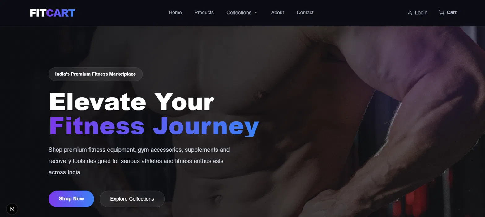
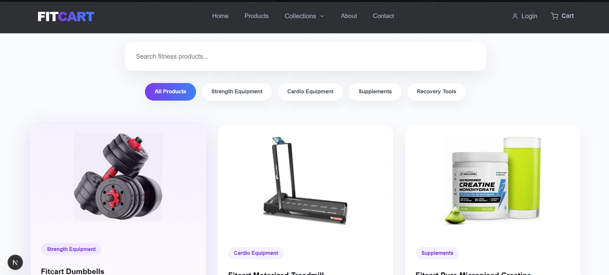
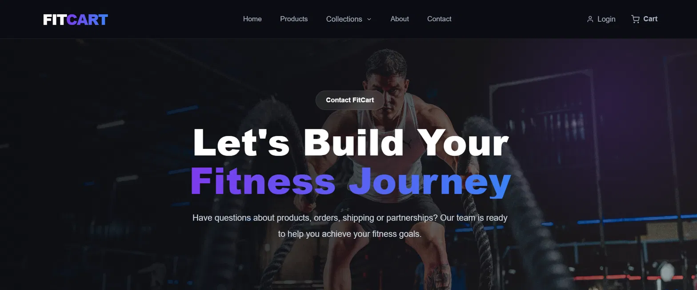

# 🏋️ FitCart — Headless Shopify E-Commerce Store

FitCart is a full-stack, headless e-commerce storefront for fitness equipment, supplements, and recovery tools — built with **Next.js (App Router)** on the frontend and **Shopify** as the commerce backend via the **Storefront API** and **Customer Account API**. It's a premium, dark-themed shopping experience with a fully working cart, GST-aware checkout, and secure Shopify-based customer authentication.

---

## 📸 Screenshots

<table>
  <tr>
    <td width="50%"></td>
    <td width="50%"></td>
  </tr>
  <tr>
    <td width="50%"></td>
    <td width="50%"></td>
  </tr>
</table>

---

## ✨ Features

- 🛒 **Live Shopify cart** — add, update quantity, and remove products in real time, backed by Shopify's actual Cart API (not a mock/local cart)
- 💰 **GST-aware order summary** — Subtotal → 18% GST → Total, calculated live as quantities change
- 🔍 **Product search & category filtering** — search by name and filter by collection (Strength, Cardio, Supplements, Recovery)
- 🔐 **Secure customer authentication** — passwordless email OTP login via Shopify's OAuth 2.0 Customer Account API, with session-gated checkout
- 👤 **Customer account page** — view profile info and saved addresses, pulled live from Shopify
- 💳 **Real Shopify checkout** — hands off to Shopify's hosted, PCI-compliant checkout for payment
- 📱 **Fully responsive** — dark, glassmorphism-inspired UI that adapts from desktop to mobile
- ⚡ **Server-rendered product data** — products and collections fetched server-side via the Storefront API for fast initial loads

---

## 🛠️ Tech Stack

**Frontend**
- [Next.js](https://nextjs.org/) (App Router)
- React
- Plain CSS (no Tailwind/Bootstrap — fully custom design system)

**Backend / Commerce**
- [Shopify Storefront API](https://shopify.dev/docs/api/storefront) (GraphQL) — products, collections, cart
- [Shopify Customer Account API](https://shopify.dev/docs/api/customer) (OAuth 2.0 + PKCE) — passwordless authentication
- Next.js API Routes — server-side proxy layer between the frontend and Shopify's GraphQL endpoints

**Hosting**
- [Vercel](https://vercel.com/)

---

## 📂 Project Structure

```
src/
  app/
    account/            # Customer account page (profile + addresses)
    api/
      auth/
        login/           # Kicks off the Shopify OAuth login flow
        callback/        # Handles Shopify's OAuth redirect, sets session cookies
        logout/          # Clears the session
        me/               # Returns current login state (used by client components)
      cart/
        [cartId]/        # GET — fetch a cart by ID
        update/           # POST — update a line item's quantity
        remove/           # POST — remove a line item
        route.js           # POST — create a cart / add a line item
    cart/                # Cart page + CartClient (all cart UI + logic)
    login/               # Login redirect page
    products/            # Product listing page
    components/
      header/             # Site navigation, login/logout state
      footer/
  lib/
    shopify.js            # Storefront API client (products, cart)
    customerAuth.js       # Customer Account API client (OAuth, PKCE, token handling)
    getSession.js         # Server-side session helpers
```

---

## 🚀 Getting Started

### 1. Clone the repo

```bash
git clone https://github.com/your-username/fitcart.git
cd fitcart
```

### 2. Install dependencies

```bash
npm install
```

### 3. Set up environment variables

Create a `.env.local` file in the project root:

```env
NEXT_PUBLIC_SHOPIFY_STORE_DOMAIN=your-store.myshopify.com
NEXT_PUBLIC_SHOPIFY_STOREFRONT_TOKEN=your_storefront_api_token

SHOPIFY_SHOP_ID=your_shop_id
SHOPIFY_CUSTOMER_ACCOUNT_CLIENT_ID=your_customer_account_client_id

NEXT_PUBLIC_SITE_URL=http://localhost:3000
```

### 4. Run the dev server

```bash
npm run dev
```

Visit [http://localhost:3000](http://localhost:3000).

---

## 🔧 Shopify Setup Required

For this project to work against your own store, configure the following in **Shopify Admin**:

1. **Storefront API** — enable it under a Headless sales channel and generate a Storefront API access token.
2. **Customer Account API** — under the same Headless channel, register a redirect URI (`https://your-domain.com/api/auth/callback`) and grab your Client ID + Shop ID.
3. **Taxes** — configure an India (or relevant region) tax rate under Settings → Taxes and duties so checkout totals match the storefront's displayed GST.
4. **Shipping** — add relevant shipping zones/countries under Settings → Shipping and delivery.
5. **Payments** — connect a supported payment gateway (e.g. Razorpay for India, since native Shopify Payments isn't available there).

---

## ☁️ Deployment

This project is deployed on **Vercel**:

1. Push the repo to GitHub.
2. Import the repo into Vercel.
3. Add all environment variables from `.env.local` into Vercel's Project Settings.
4. Update `NEXT_PUBLIC_SITE_URL` to your live Vercel URL, and register that same URL's `/api/auth/callback` as the Callback URI in Shopify's Customer Account API settings.
5. Deploy 🚀

---

## 📄 License

This project is for personal/portfolio use.

---

## 👨‍💻 Developer

**Soham Aeer**

Full Stack Developer · React · Node.js · Express · MERN · DevOps / VPS Deployment

- Portfolio: https://soham-aeer-fullstack-portfolio.web.app/
- GitHub: https://github.com/Sohamayer
- LinkedIn: https://www.linkedin.com/in/soham-aeer